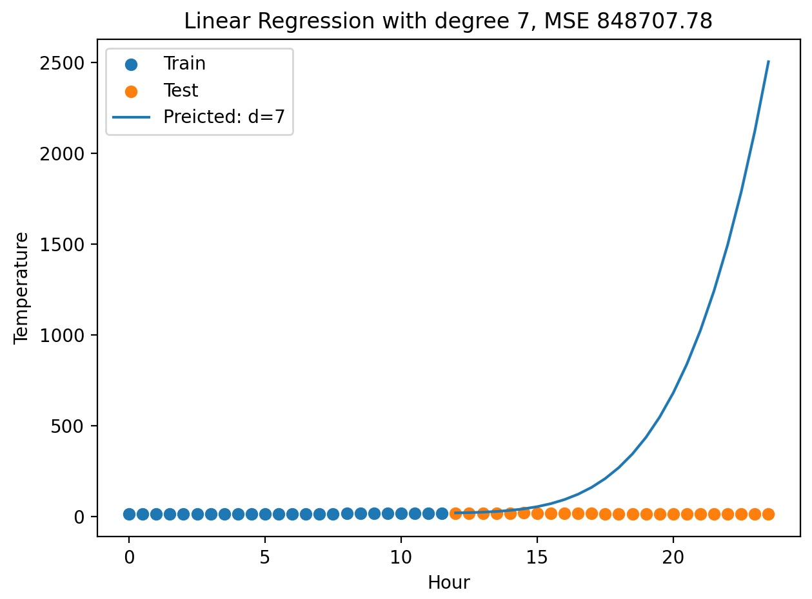

# Jerusalem Temperature Regression

> Predicting half-day temperatures (Nov 16 2024) with classical and Bayesian
> linear regression using polynomial, Fourier and cubic-spline basis functions.

---

## What the code does

1. **Basis-function factories**

   | Module function | Output | Comment |
   | --------------- | ------ | ------- |
   | `polynomial_basis_functions(d)` | Φ ∈ ℝ<sup>N×(d+1)</sup> | scaled \(t/d\)ᵏ to reduce numeric blow-up |
   | `fourier_basis_functions(K)`    | Φ ∈ ℝ<sup>N×(2K+1)</sup> | \( \cos,\sin\bigl(2πk t/24\bigr) \) |
   | `spline_basis_functions(knots)` | Φ ∈ ℝ<sup>N×(k+4)</sup> | cubic regression splines |

2. **Models**

   * `LinearRegression` – ordinary least squares  
   * `BayesianLinearRegression` – conjugate update with Gaussian prior  
     * `learn_prior()` fits that prior from the historic **jerus_daytemps.npy** file.

3. **Experiments (`main()`):**

   * Split Nov 16 data into AM training vs PM test (24 points each).
   * Fit/plot for  
     * polynomial degrees *d* ∈ {3, 7}  
     * Fourier harmonics *K* ∈ {1, 2, 3}  
     * splines with 1–3 interior knots.
   * For Bayesian runs:  
     * visualise prior mean ± σ • posterior MMSE ± σ and posterior samples  
     * print test-set MSE.

Plots pop up with Matplotlib: each figure is auto-titled with the basis-function
family and error metric.

---

## Quick start
```bash
# 1. clone repo & cd
git clone https://github.com/GuyShmueli/bayesian-machine-learning/jerusalem-temperature-regression.git
cd jerusalem-temperature-regression

# We only need numpy + matplotlib:
pip install numpy matplotlib

# 3. run all experiments & figures
python temp_prediction.py
```

### Linear Regression - demonstrating the huge model-data mismatch 


### Bayesian Linear Regression - Linear model fitting when Prior parameters are used 


### Bayesian Linear Regression - Linear model fitting when Posterior parameters are used 


### Bayesian Linear Regression - Fourier model fitting when Prior parameters are used 


### Bayesian Linear Regression - Fourier model fitting when Posterior parameters are used 


### Bayesian Linear Regression - Cubic model fitting when Prior parameters are used 


### Bayesian Linear Regression - Cubic model fitting when Posterior parameters are used 


